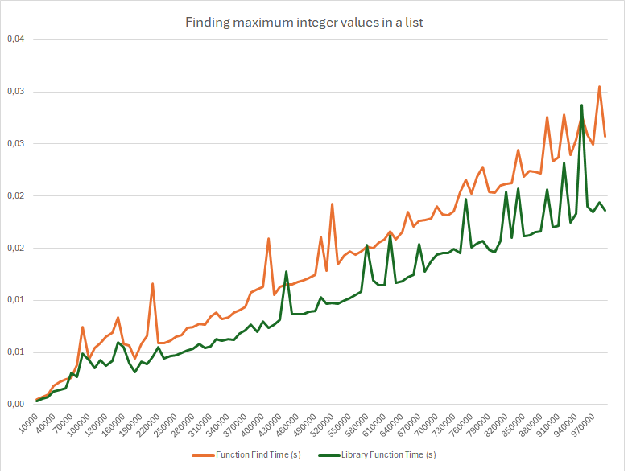

<!--- https://skerritt.blog/big-o/ -->
<!--- https://www.bigocheatsheet.com/ -->
<!--- https://inventwithpython.com/beyond/chapter13.html -->
<!--- https://github.com/pberkes/big_O -->

# Measuring Execution Time
    
When analyzing the performance of algorithms and data structures, it's important to be able to measure the execution time of code. This allows you to compare the efficiency of different solutions and identify potential bottlenecks in your code.

Using the [timeit](https://docs.python.org/3/library/timeit.html) module in Python is a convenient way to measure the execution time of a given Python function. Here's a step-by-step guide on how to do it:

1. **Import the `timeit` module**: Start by importing the `timeit` module.

2. **Define your function**: Write the Python function that you want to measure the execution time for.

3. **Create a `Timer` object**: Use `timeit.Timer()` to create a Timer object. Pass it two arguments: a string representing the code to be measured (typically a function call) and optionally, a setup statement. The setup statement is code that you want to execute once before measuring the execution time.

4. **Call the `timeit()` method**: Use the `timeit()` method of the Timer object to measure the execution time. You can specify the number of times to run the code (the default is 1,000,000) using the `number` parameter.

Here's a code example:

```python
import timeit

# Define the function you want to measure
def my_function():
    # Your function's code here
    result = sum(range(10000))
    return result

# Create a Timer object with the function call as a string
timer = timeit.Timer("my_function()", globals=globals())

# Measure the execution time
execution_time = timer.timeit(number=1000)  # Run the code 1000 times

print("Execution time:", execution_time, "seconds")
```

In this example, replace `my_function()` with the function you want to measure. The `globals=globals()` argument allows `timeit` to access the global namespace, including your function. Adjust the `number` parameter as needed based on how many times you want to run the function to get an accurate measurement. Finally, the `timeit()` method returns the time taken for the specified number of executions of the given code.

By measuring the execution time of different functions and algorithms, you can gain insights into their performance characteristics and make informed decisions about which approach to use in your code.

## Example

Let's measure the execution time of a simple function that finds out the maximum value of the given list using  a for loop and the built-in `max()` function. We'll compare the execution time of the two approaches to see which one is faster.

```python
import csv
import timeit
import random


# This is our custom function to find out the maximum value of the given integer list
def myMax(list1):
    # Assume first number in list is largest
    # initially and assign it to variable "max"
    max = list1[0]
    # Now traverse through the list and compare
    # each number with "max" value. Whichever is
    # largest assign that value to "max'.
    for x in list1:
        if x > max:
            max = x

    # after complete traversing the list
    # return the "max" value
    return max


# This function generates a random array of the given size
def generate_random_array(size):
    return [random.randint(1, 1000) for _ in range(size)]


# Test different array sizes
array_sizes = list(range(10000, 1000001, 10000))

with open('maxfind_algorithm_times.csv', mode='w', newline='') as file:
    writer = csv.writer(file)
    writer.writerow(['N', 'myMax Function Time (s)', 'Library Function Time (s)'])

    for size in array_sizes:
        arr = generate_random_array(size)

        # testing myMax function
        myMax_time = timeit.timeit(stmt='myMax(arr[:])', globals=globals(), number=1)

        # testing library max function
        libMax_time = timeit.timeit(stmt='max(arr[:])', globals=globals(), number=1)

        writer.writerow([size, myMax_time, libMax_time])
```

In this example, we're using the `timeit.timeit()` function to measure the execution time of the `myMax()` function and the built-in `max()` function for different array sizes. We're generating random arrays of different sizes and measuring the execution time of both functions for each array size. The results are written to a CSV file for further analysis.

The graphical representation of the results is shown below:


From the picture it can be seen that the built-in `max()` function is significantly faster than our custom `myMax()` function. This is expected, as the built-in functions in Python are highly optimized and written in C, making them much faster than custom Python code. Both implementations belong to the same $O(n)$ complexity class, because the curve has $y=ax+b$ shape.
There are fluctuations in execution time, this is because the execution time of a function can be affected by many factors, such as the current state of the system, the load on the CPU, and other running processes. Therefore, it's important to run multiple tests and average the results to get a more accurate measurement.