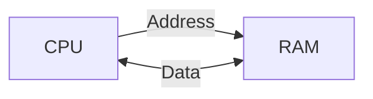
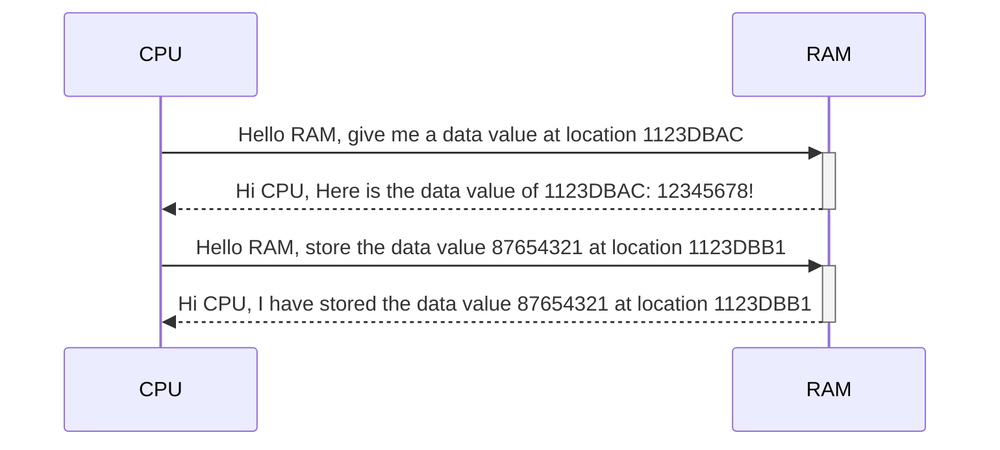
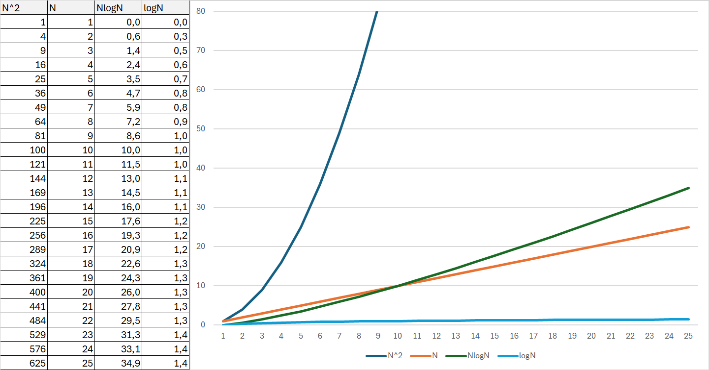

# Supplement material to the Algorithms and Data Structures course in Python

This is supplement material to the Data Structures and Algorithms (TX00EY28) course

## Motivation

What every computer science major should know (http://matt.might.net/articles/what-cs-majors-should-know/, Matt Might is an assistant Professor in University of Utah):
- Students should certainly see the common (or rare yet unreasonably effective) data structures and algorithms
- But, more important than knowing a specific algorithm or data structure (which is usually easy enough to look up), computer scientists must understand how to design algorithms (e.g., greedy, dynamic strategies) and how to span the gap between an algorithm in the ideal and the nitty-gritty of its implementation
- Specific recommendations
  - At a minimum, computer scientists seeking stable long-run employment should know all the following:
    - hash tables
    - linked lists
    - trees
    - binary search trees, and
    - directed and undirected graphs
  - Computer scientists should be ready to implement or extend an algorithm that operates on these data structures, including the ability to search for an element, to add an element and to remove an element

This course involves less coding, and more thinking about how to complete the tasks. During this course, we try to improve our thinking skills more than our coding skills. After all, [programming Is Mostly Thinking](https://agileotter.blogspot.com/2014/09/programming-is-mostly-thinking.html).

## Useful books (not mandatory):
- Practical oriented: Heineman, Pollice, Selkow:  Algorithms in a Nutshell, O’Reilly, 2009 
    - Available from the Internet (e.g., Google books)
- Used in Aalto and MIT: Cormen, Leiserson, Rivest, Stein: Introduction to Algorithms, MIT Press, 2009
- Good book about algorithms in general: Skiena, The Algorithm Design Manual, Springer, 2012
- For Gurus, __The__ algorithm book: Knuth, The Art of Computer Programming, Vols. 1-4A, Addison-Wesley, 2011

## Useful links
- Good algorithm visualization tool: https://visualgo.net/en
- Another data structure visualization tool: https://csvistool.com/
- Just another visualization tool: https://www.cs.usfca.edu/~galles/visualization/Algorithms.html

## Computer Architecture

To understand how computers work, it is essential to have a basic understanding of computer architecture. Computer architecture refers to the design of a computer system, including its components and the way they interact to perform tasks. Key components of computer architecture include the central processing unit (CPU), memory, input/output devices, and the system bus.

The connection between a microprocessor and RAM (Random Access Memory) is essential for the operation of a computer. The microprocessor, often referred to as the CPU, is responsible for executing instructions and performing calculations. It relies on RAM as a temporary storage area for the data and instructions it needs to access quickly while executing tasks.



When a program runs, the CPU fetches instructions and data from RAM, which acts as a high-speed workspace. This interaction occurs through a bus system that includes data, address, and control buses. The data bus carries the actual data between the CPU and RAM, while the address bus specifies the memory location the CPU wants to access. The control bus sends signals that dictate whether the CPU is reading data from RAM or writing data back into it.

In computer memory, an address refers to a specific location where data or instructions are stored. Each memory location in a computer has a unique address, allowing the CPU and other components to access and manage data efficiently.

The address space is the range of addresses that a system can use. This can vary depending on the architecture of the computer. For instance, a 32-bit architecture typically has a theoretical address space of 4 GB ($2^{32}$ addresses), while a 64-bit architecture can address a significantly larger space, theoretically up to 16 exabytes ($2^{64}$ addresses).
> By 32-bit architecture, we mean that the main CPU registers are 32-bit wide, and the address bus is 32-bit wide. The 32-bit architecture is still widely used, but the 64-bit architecture is becoming more common due to its ability to address a larger memory space.




The speed of RAM is significantly higher than that of secondary storage devices like hard drives or SSDs, allowing the CPU to perform operations efficiently. However, RAM is volatile, meaning it loses its contents when the power is turned off, making it suitable for temporary data storage during processing.

In modern computer architectures, [cache memory](https://en.wikipedia.org/wiki/CPU_cache) is also used to further enhance performance. This smaller, faster memory is located closer to the CPU and stores frequently accessed data and instructions, minimizing the time the processor needs to fetch information from RAM.

Overall, the interplay between the microprocessor and RAM is vital for ensuring smooth and efficient computing, as the CPU continuously interacts with RAM to retrieve and manipulate the data necessary for executing programs.


## Recursion

[Recursion](https://en.wikipedia.org/wiki/Recursion) in computer science refers to a programming technique where a function calls itself to solve a problem. Instead of using iteration (loops) to repeatedly execute a set of instructions, a recursive function breaks down a problem into smaller, more manageable subproblems, eventually reaching a base case where the solution can be directly computed.

The basic structure of a recursive function includes:

1. **Base Case**: This is the terminating condition that prevents the function from calling itself indefinitely. It provides the exit condition for the recursive loop.

2. **Recursive Case**: This is the part of the function where it calls itself with modified arguments, typically working towards the base case.

Recursion is often used to solve problems that can be broken down into smaller, similar subproblems. Examples include problems related to tree and graph traversal, searching and sorting algorithms (e.g., quicksort, merge sort), mathematical calculations (e.g., factorial, Fibonacci sequence), and more. Here's a simple example of a recursive function to calculate the factorial of a number:

```python
def factorial(n):
    if n > 0:
        return n * factorial(n - 1)
    else:
        return 1
```
> Factorial is used to calculate the number of [permutations](https://en.wikipedia.org/wiki/Permutation) of a set of objects. For example, the factorial of 5 (written as 5!) is 5 * 4 * 3 * 2 * 1 = 120. This means that you are able to arrange 5 items in 120 different ways.

### Call stack

Function calling system uses stack data structure. The role of this stack in recursion is crucial for understanding how recursive function calls are managed and executed by a computer program.

When a function is called in a program, the computer allocates a region of memory known as the call stack to store information about the function call. This information typically includes the function's parameters, local variables, and the return address, which tells the program where to continue execution after the function call completes.

In the case of recursion, each recursive call to a function adds a new entry, called a stack frame, to the call stack. This stack frame contains the information mentioned earlier (parameters, local variables, return address) specific to that particular invocation of the function.

As the recursion progresses, more and more stack frames are added to the call stack, each representing a nested invocation of the recursive function. When the base case is reached, the recursion starts to unwind. At this point, each function call returns its result and removes its corresponding stack frame from the call stack, allowing the program to resume execution from where it left off.

The call stack thus serves as a mechanism for managing the sequence of recursive function calls and ensuring that the program can keep track of its execution state, even in the presence of nested recursive calls.

However, it's important to note that excessive recursion can lead to stack overflow errors if the call stack grows too large and exhausts the available memory. This is why it's essential to ensure that recursive algorithms have well-defined base cases and termination conditions to prevent such issues.

### Efficiency

However, it's worth noting that recursion may not always be the most efficient solution, as it can consume a significant amount of memory due to the recursive function calls and the stack frames they occupy. In some cases, iterative solutions may be preferred for performance reasons.

### Problem-solving with recursion

Recursion is a powerful technique that can be used to solve a wide range of problems. Eight queens problem is a classic example of a problem that can be solved using recursion. [Here](1.6_EightQueens.md)'s a brief overview of the problem and how recursion can be applied to solve it.
  
# Performance Families

We compare algorithms by evaluating their performance on input data of size $n$. This methodology is the standard means developed over the past half-century for comparing algorithms. By doing so, we can determine which algorithms scale to solve problems of nontrivial size by evaluating the running time needed by the in relation to the size of the provided input. A secondary form of performance evaluation is to consider how much memory or storage an algorithm needs.

If the size of the input data is $n$, then the running time of an algorithm is expressed as a function of $n$. The notation $O(f(n))$ is used to describe the upper bound of the running time of an algorithm in terms of $n$. This notation is called Big O notation.

We use the following classifications exclusively to compare algorithms, and they are ordered by decreasing efficiency:
- **Constant**: $O(1)$
- **Logarithmic**: $O(\log n)$
- **Sublinear**: $O(n^d), d < 1$, e.g. $O(\sqrt{n})$
- **Linear**: $O(n)$
- **Linearithmic**: $O(n \log n)$
- **Quadratic**: $O(n^2)$
- **Cubic**: $O(n^3)$
- **Exponential**: $O(2^n)$

> We don't need to specify the base of the logarithm here, because the base of the logarithm does not affect the order of growth of the function. Different logarithm values differ only with a constant factor, i.e., $\log_2 n = \frac{\log_{10} n}{\log_{10} 2}$. For example, $\log_2 n$ and $\log_{10} n$ are both $O(\log n)$.

If the size of the problem $n$ is small, then the running time of an algorithm is not a concern. However, as the size of the problem grows, the running time of the algorithm becomes a critical factor. Look the picture below to see how the running time of different complexity classes scales with the size of the input data (N).



## Why Divide-and-Conquer works?

The divide-and-conquer strategy works because it breaks down a problem into smaller, more manageable subproblems, solves them independently, and then combines the solutions to the subproblems to form the solution to the original problem. Let's have an example: If the original problem has a complexity class $O(n^2)$ this means that the execution time is $T_{orig} = an^2 + bn + c$, where $a$, $b$, and $c$ are constants. If we divide the problem into two subproblems, each of size $n/2$, then the total execution time of the two subproblems is $T_{divq} = 2(a(n/2)^2 + b(n/2) + c) = an^2/2 + bn + 2c$. The execution time of the original problem $T_{orig}$ is much larger than $T_{divq}$. This is the reason why divide-and-conquer works. In general, divide and conquer method works only if the complexity class is worse than $O(n)$. If the complexity class is $O(n)$ or better, then the divide-and-conquer method does not give any advantages.

## Why we need suboptimal solutions

Let's assume that we have a function $f(x_{1}, x_{2}, x_{3}, \ldots, x_{n})$ and we want to find the values of $x_{i}$ that minimizes or maximizes the function $f$. If we restrict the values of $x_{i}$ to binary values, then the total number of possible solutions is $2^n$.
 Thus, the number of possible solutions is finite, and we can use brute-force to find the optimal solution, i.e. we evaluate the value of the function with every possible combination of the parameter values $x_{i}$. Assume that the $n=100$, then the number of possible solutions is $2^{100} \approx 10^{30}$. If we can evaluate $10^9$ solutions per second, then we need $10^{21}$ seconds to evaluate all possible solutions. This is more than [the remaining time of our sun](https://spaceplace.nasa.gov/sun-age/en/), which is about $10^{17}$ seconds. These kinds of problems, where the number of possible solutions is huge, are called [NP-hard](https://en.wikipedia.org/wiki/NP-hard) problems.

Thus, we need suboptimal solutions to solve these NP-hard (Non-Polynomial time) problems. The suboptimal solutions are not the best solutions, but they are good enough to solve the problem. The suboptimal solutions are faster to find than the optimal solutions. There are many methods to find suboptimal solutions, e.g.
- greedy algorithms
- [simulated annealing](https://en.wikipedia.org/wiki/Simulated_annealing)
- [genetic algorithm](https://en.wikipedia.org/wiki/Genetic_algorithm)
- [evolutionary computation](https://en.wikipedia.org/wiki/Evolutionary_computation)
- etc.

## Object-Orientation in Python

A decent introduction of object-orientation in Python can be found in [this](https://acme.byu.edu/0000017a-17ef-d8b9-adfe-77ef21070000/oop-pdf) document. [Here](1.0_Object_Orientation_python.md) are some of the most important topics.

## Advanced Python concepts
- [List Comprehensions](1.1_List_Comprehension.md)
- [Generators](1.2_Generators.md)
- [Lambda Functions](1.3_Lambda_Functions.md)
- [Regular Expressions](1.4_Regular_Expressions.md)
- [Measuring Execution Time of Python Functions](1.5_Execution_Time_Measurement.md)

## Corrections in the Moodle material

Test exam contains a couple of errors in the questions and answers. Here are the corrections:
Question "Given these different time complexities .." the correct answer has an error. Complexity class $O(n \log n)$ is harder than $(n)$, because the $O(n \log n)$ is a superlinear complexity class, and the $O(n)$ is a linear complexity class. The superlinear complexity class is worse than the linear complexity class.

Question "Write the second entry of a hash table that results from using the hash function, f(x) = (5*n + 3) mod 8, to hash the keys 50, 27, 59, 1, 43, 52, 40, 63, 9 and 56, assuming collisions are handled by chaining. Write the result as a Python list." has incorrect answer [27, 49 ,53], the correct answer is [27, 59 ,43].
